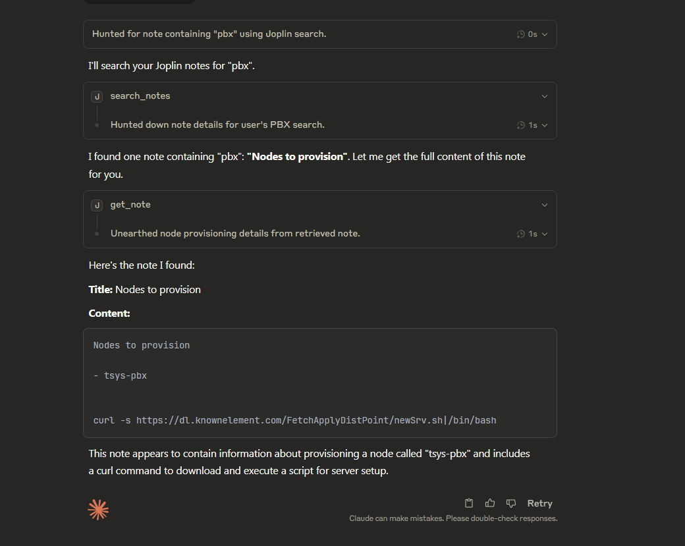

- URLs:
	-  https://mcpmarket.com/server/joplin
	-  https://github.com/dweigend/joplin-mcp-server

-  Here is the config:
```json
{
  "mcpServers": {
    "joplin": {
      "command":"C:\\Users\\tsys\\.local\\bin\\uv.exe",
      "args": [
        "--directory",
        "E:/tsys/LLM/MCP/joplin-mcp-server",
        "run",
        "src/mcp/joplin_mcp.py"
      ]
    }
  }
}
```

- Status: Configured and deployed in Claude Desktop

Here is the successful execution:

